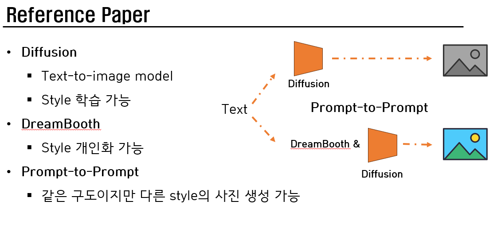
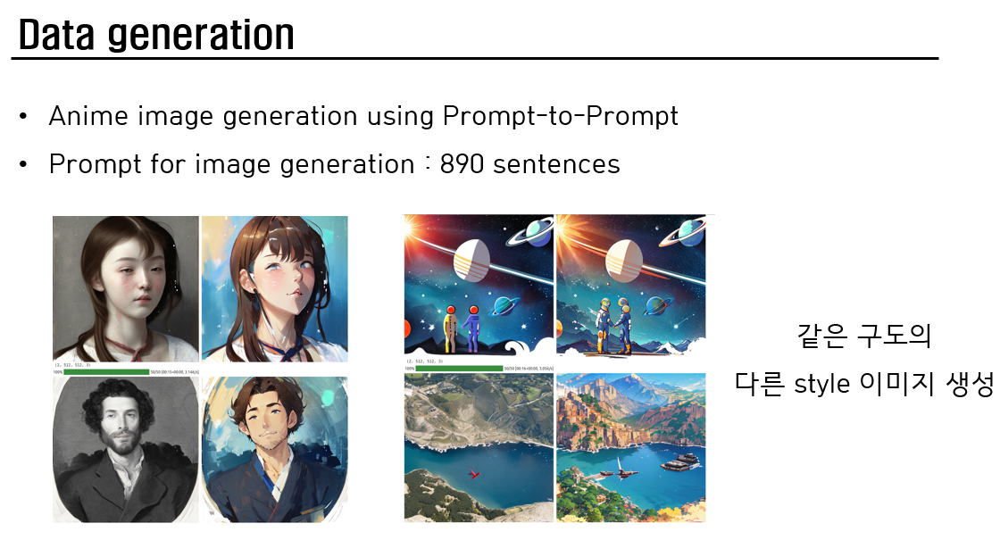
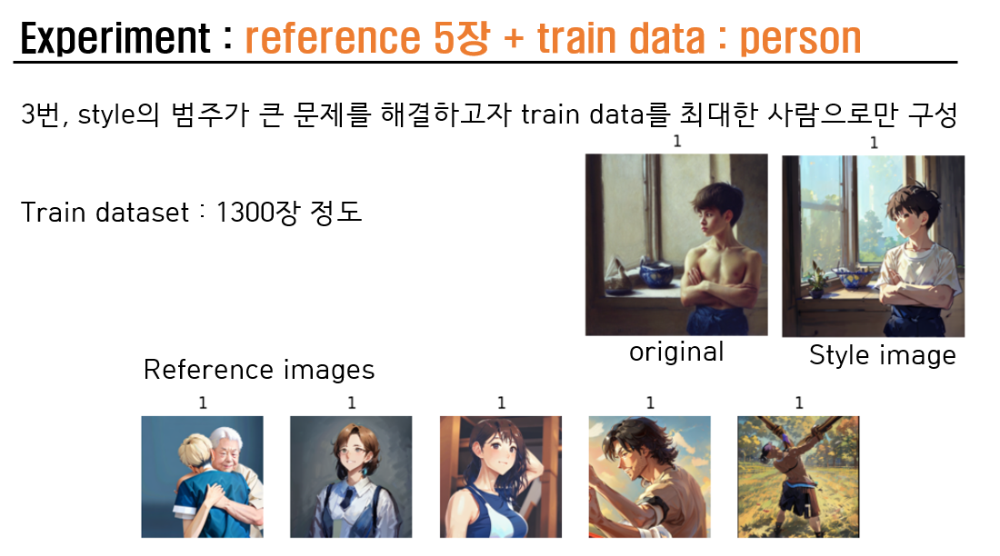

## Setting
- Diffusers==0.17.1 (reference site 아래와 같이, 0.17.1 로 install 한 뒤에 코드 수정도 같이 해줬다. (in ptp_utils.py)
- CUDA: 11.2/3
- torch==2.0.0
- .ipynb code 는 reference site 위를 보고 한거라 둘 중에 맞는 거로 하면 된다.
- Reference site: <a href='https://github.com/google/prompt-to-prompt/issues/57'>Issues</a>

<strong>원본을 유지하면서 image editing을 하는 method</strong>
본 프로젝트에서는 원본을 유지하면서 특정 style을 입히는 실습을 했다.

* image + anime style = anime image

